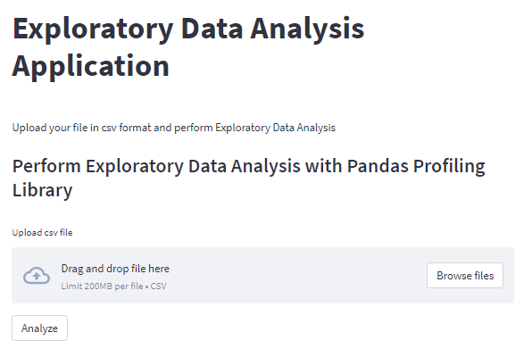
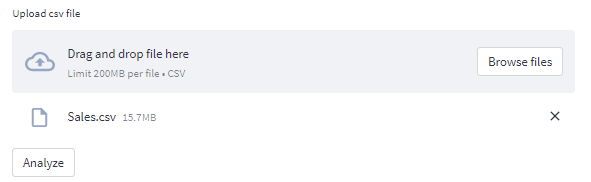

# Streamlit app automating Exploratory Data Analysis.

Exploratory Data Analysis refers to the critical process of performing initial investigations on data to discover patterns, spot anomalies, test hypothesis and to check assumptions with the help of summary statistics and graphical representations. In this platform I will display the power of Python using the streamlit library to build an EDA tool.
I have built a KPI that performs complete customized data analysis based on the data provided by the user.

Upload your file in csv format and perform Exploratory Data Analysis with this tool!
 
---
Deployed Streamlit App: https://richiegarafola-eda.streamlitapp.com/
---

**Tech Used:** Streamlit for the open-source app framework, Pandas for reading in the csv file, pandas_profiling / streamlit_pandas_profiling for the Exploratory Data Analysis.

Provided is a data folder of example datasets to quickly test the application yourself.
It is encouraged to use your own data as this tool can handle any csv file. 

**Test Data:** [Test Data](Sales.csv)

---

**How to use this tool:**
1. Click the 'Browse files' button

2. Select the CSV file of your choosing

3. Analyze

4. Wait momentarily while all the heavy lifting is being done 

5. Explore your findings! 

---

Developed by
Richie Garafola 10/2022
